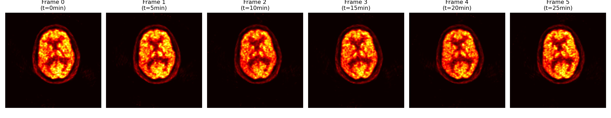
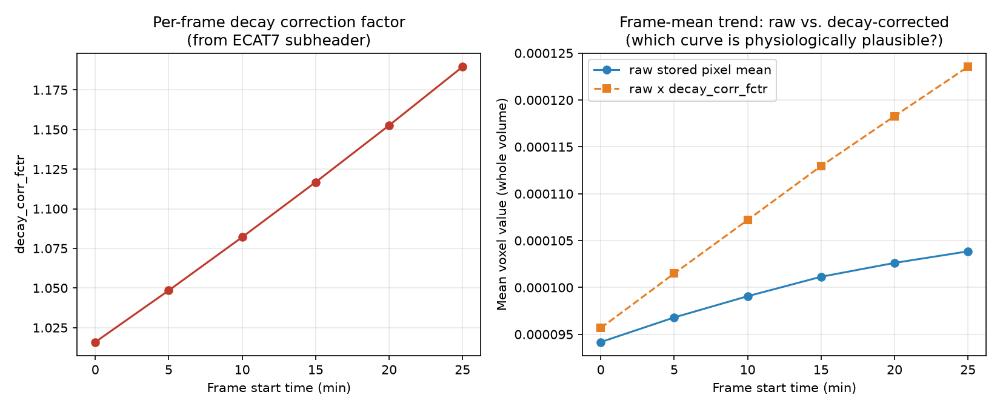

# ECAT7 decay-correction question (for PET physics review)

## Question

For CTI/Siemens ECAT7 format PET raw exports (ADNI-sourced), does the `corrections_applied`
bitmask value observed below indicate that decay correction has already been applied to the
stored frame pixel values? If not applied, is multiplying each frame's data by its own
`decay_corr_fctr` before summing frames the correct way to produce a decay-corrected static
image?

## File details

Representative sample, one of 179 similar series in our dataset:

- Format: ECAT7, software version 7.2 (`sw_version=72`), `system_type=962`
- Isotope: F-18 (`isotope_halflife=6586.2s`, matches F-18's 109.77 min half-life),
  radiopharmaceutical FDG
- 6 dynamic frames, 300s (5 min) each, 30 min total acquisition
- `corrections_applied` (subheader field, `uint32`): **2947**, identical across all 6 frames

Per-frame `decay_corr_fctr` and `frame_start_time` (subheader fields), plus the mean voxel
value observed in each frame's raw (unmodified) pixel data:

| Frame | frame_start_time (ms) | decay_corr_fctr | mean voxel value |
|---|---|---|---|
| 0 | 16 | 1.0158712 | 9.417e-5 |
| 1 | 300016 | 1.0484567 | 9.680e-5 |
| 2 | 600016 | 1.0820874 | 9.907e-5 |
| 3 | 900016 | 1.1167969 | 1.011e-4 |
| 4 | 1200016 | 1.1526197 | 1.026e-4 |
| 5 | 1500016 | 1.1895915 | 1.039e-4 |

Mid-axial slice from each of the 6 raw frames (same sample series), for reference. Each
panel is independently scaled to its own max, so this does not show the decay-correction
trend by itself — see the plot below for that.

Left: the per-frame `decay_corr_fctr` itself, rising smoothly with frame time as expected
from F-18 decay physics. Right: the frame-mean voxel value over the same 6 frames, plotted
both as stored (raw) and as raw × `decay_corr_fctr` — these are the two candidate
interpretations, and they diverge enough (decelerating ~1-3%/frame vs. a steeper, still
climbing ~4-6%/frame) that someone familiar with typical 0-30 min FDG brain uptake kinetics
may be able to tell which curve shape looks physiologically right.

## Specifically what we need

1. The bit-flag definitions for `corrections_applied` (which bit, if any, means "decay
   correction applied to stored counts") — or confirmation of what `2947` decodes to.
2. Whether `decay_corr_fctr` in this export represents a factor still needing to be applied
   (like ADNI's Interfile/HRRT exports, where an equivalent field is present but explicitly
   unapplied), or one that's already baked into the pixel values.

## Why we're asking

We need to combine these 6 dynamic frames into a single static, correctly decay-corrected
image for radiomics analysis, and applying the wrong assumption either double-corrects or
leaves it under-corrected — both are real quantitative errors, not just cosmetic ones.

Raw frame images aren't needed to answer this — decay correction is a uniform per-frame
scalar multiplier, invisible in a single frame's visual appearance. The header metadata and
frame-mean trend above should be sufficient for anyone familiar with the ECAT7/CTI export
format or the ADNI PET acquisition protocol.

## Context (not needed by the reviewer, for our own record)

This mirrors a bug already found and fixed in ADNI's Interfile-format PET exports (see
`docs/KNOWLEDGE.md` "Image ingestion"): those had an explicit, unambiguous `applied decay
correction factor` header field that was blank, confirming the scanner computed but did not
apply the correction. ECAT7 lacks that explicit field — only the `corrections_applied`
bitmask above — so the same fix cannot be safely assumed without confirming what that bitmask
means. Affects `src/dlb_radiomics/ingest.py`'s `_collapse_dynamic_frames` (currently a plain
mean across frames with no decay correction) for the 179 ECAT7-sourced series in the cohort.
